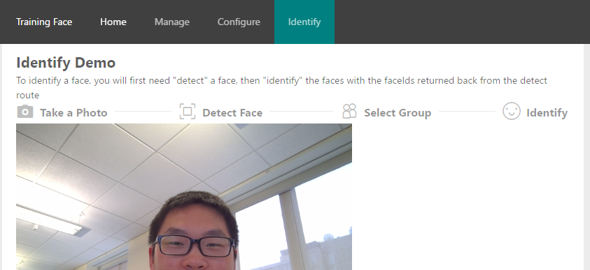

---
# You don't need to edit this file, it's empty on purpose.
# Edit theme's home layout instead if you wanna make some changes
# See: https://jekyllrb.com/docs/themes/#overriding-theme-defaults
layout: default
---

# Cognitive Services Face API Training

The goal of this project is to create a dashboard for users to manage and test their [Cognitive Services Face API](https://www.microsoft.com/cognitive-services/en-us/face-api), given that they have a Face API Key

## Features
* Manages your Person, Person Group, and Training of your Face API
* Locally Storing your Face API Key
* Nicely formated User Data for the Person entities
* Quickly submit Face entities using the webcam

## Getting Started
You can go to the [Live App](https://train-faces.azurewebsites.net/#/).

Or if you want to Spin up your own instance of the Training Face, you will need `node`, `npm` or [`yarn`](https://yarnpkg.com/en/):
1. clone this repository
2. run `npm install --production` (this will take a little while)
3. run `node server`
4. go to [`http://localhost:3000`](http://localhost:3000)

----
## Technical Details

### Key Application Dependencies
#### Backend
* [express](https://expressjs.com/) (Server)
* [project-oxford](https://github.com/felixrieseberg/project-oxford) (Face API Client)

#### Frontend
* [react](https://www.npmjs.com/package/react) (View Layer)
* [redux](https://www.npmjs.com/package/redux) (App State Management)
* [react-router](https://www.npmjs.com/package/react-router) (Router for React)
* [antd](https://www.npmjs.com/package/antd) (React Component Library)
* [react-json-tree](https://www.npmjs.com/package/react-json-tree) (Render Json Tree)
* [react-ace](https://www.npmjs.com/package/react-ace) (AceEditor for react)
* [lodash.get/set](https://www.npmjs.com/package/lodash.get) (Access deeply nested values)

#### Development Tools
* [webpack](https://webpack.js.org/) (Asset/Package Bundling)
* [babel](https://babeljs.io/) (Transpiles ES7 to ES5)
* [webpack-hot-middleware](https://github.com/glenjamin/webpack-hot-middleware) (Hot Module Replace)
* [plop](https://github.com/amwmedia/plop) (Code Generator)
* [eslint](http://eslint.org/) (Code Style Linter)

### Getting Started with Development
1. clone this repository
2. run `yarn` (might take a while)
3. run `yarn start`
4. go to [`localhost:3000`](http://localhost:3000)

### To Contribute
Please refer to the [CONTRIBUTING.md](https://github.com/howlowck/train-faces/blob/master/CONTRIBUTING.md)

